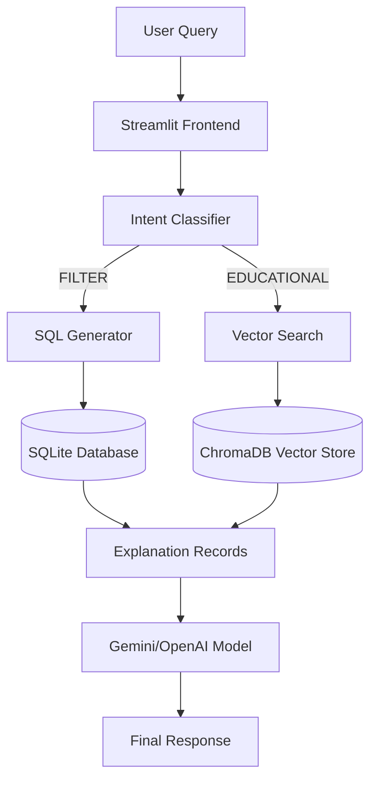

# 🏠 Real Estate Investment Analyzer

<div align="center">

**A Deterministic Financial System augmented by a RAG (Retrieval-Augmented Generation) Interface**

[](https://www.python.org/)
[](https://streamlit.io/)
[](https://www.trychroma.com/)
[](https://www.sqlite.org/)
[](https://openrouter.ai/)

*Combines the safety of SQL-based financial analysis with the intelligence of Semantic Search.*

</div>

---

## 📖 Table of Contents

1.  [Project Overview](#-project-overview)
2.  [Design Philosophy](#-design-principles)
3.  [Data Pipeline](#-data-pipeline)
    *   [1. Web Scraping](#1-web-scraping)
    *   [2. Data Wrangling](#2-data-wrangling)
    *   [3. Financial Calculations](#3-financial-calculations)
4.  [RAG Architecture](#-rag-architecture)
5.  [Project Structure](#-project-structure)
6.  [Setup & Installation](#-setup--installation)
7.  [Usage Guide](#-usage-guide)

---

## 🎯 Project Overview

This is a **Hybrid RAG Application** designed to analyze Real Estate investments (Buy vs Rent) in the **Kolkata** market. Unlike standard chatbots that hallucinate numbers, this system adheres to a strict **"Explanation-Second"** architecture.

*   **Deterministic Backend**: All financial outcomes (EMI, Tax, Wealth Difference) are pre-calculated using Python/Pandas logic.
*   **RAG Layer**: The AI is strictly an *interface*. It retrieves verified data and explains it, but **never** performs financial math itself.

---

## 📝 Design Principles

This project strictly follows the **Real Estate Analyzer RAG Manual**:

1.  **No Calculus in LLM**: The LLM is a narrator, not a calculator. All numbers (EMI, Rent Yield, Wealth Gain) are computed in Python.
2.  **SQL First**: For specific property queries (e.g., "3 BHK in Salt Lake"), we use SQL for exact retrieval.
3.  **Vector Second**: For educational queries (e.g., "How is tax calculated?"), we use ChromaDB vector search.
4.  **Property Explanation Records**: Raw CSV data is converted into "text summaries" before embedding, allowing the LLM to understand property features semantically.

---

## 🔄 Data Pipeline

The system is built on a robust data pipeline that transforms raw web data into actionable financial insights.

### 1. Web Scraping
**Source**: `webscraping.ipynb`
*   **Target**: MagicBricks (Kolkata Region).
*   **Scope**: Residential Properties (Apartments, Villas, Builder Floors).
*   **Method**:
    *   Scraped separate datasets for **BUY** (For Sale) and **RENT** (For Rent) listings.
    *   Extracted key attributes: `Price`, `Rent`, `Carpet Area`, `Bedrooms`, `Address`, `Furnishing`.
    *   Handled pagination to scrape ~160 pages of Buy listings and ~130 pages of Rent listings.

### 2. Data Wrangling
**Source**: `Data Wrangling.ipynb`
*   **Cleaning**:
    *   Converted raw price strings (e.g., "1.5 Cr", "60 Lac") into actual integers.
    *   Standardized addresses to remove noise.
*   **Imputation**:
    *   **The "Rent Estimator"**: Most "For Sale" properties don't have a rental price.
    *   The system calculated the **Median Rent per Sqft** for every locality using the "Rent" dataset.
    *   This multiplier was then applied to "Sale" properties to estimate their potential rental income.
*   **Outlier Removal**:
    *   Used **IQR (Interquartile Range)** filtering to remove properties with unrealistic price-to-rent ratios or data entry errors.

### 3. Financial Calculations
**Source**: `calculations.ipynb`
This is the heart of the system. It runs a 20-year simulation for every property.

#### 🏦 Home Loan Logic
*   **LTV (Loan to Value)**: Follows RBI norms (90% loan for <30L, 80% for 30-75L, 75% for >75L).
*   **Tenure**: Assumed 20 years.
*   **Interest Rate**: Average of top 5 banks (SBI, HDFC, ICICI, etc.) ~8.0% floating.

#### ⚖️ Tax Regime Simulation
The system simulates two tax scenarios for every year of the loan:
*   **Old Regime**: Claims deductions under **Section 24(b)** (Interest) and **80C** (Principal).
*   **New Regime**: Lower tax slabs but no deductions.
*   **Decision**: The algorithm automatically switches regimes each year to minimize total tax liability.

#### 💰 Wealth Comparison (The "Decision")
*   **Buying Wealth**: `(Final Property Value * Appreciation)` - `(Interest Paid + Maintenance + Taxes)`.
*   **Renting Wealth**: The user invests the difference between (EMI + Down Payment) and (Rent) into an **SIP (Mutual Fund)** with 10% annual returns.
*   **Final Output**: `decision` ("BUY" or "RENT") based on which strategy yields higher net worth after 20 years.

---

## 🏗️ RAG Architecture



*   **Intent Classifier**: Decides if the user wants *data* (SQL) or *knowledge* (Vector).
*   **Hybrid Retrieval**:
    *   **SQL**: "Show me flats under 1 Cr" -> `SELECT * FROM properties WHERE price < 10000000`
    *   **Vector**: "Is it better to buy or rent?" -> Retrieves `educational_concepts.json` chunks.

---

## 📦 Project Structure

```bash
Real_estate_analyser/
├── app.py                     # 🚀 Main Application (Streamlit)
├── run_app.bat                # 🖱️ One-click launcher
├── .env                       # 🔑 API Keys
├── real_estate.db             # 💾 SQLite DB (Financial Results)
│
├── rag/                       # 🧠 RAG Logic Module
│   ├── rag_engine.py          # Master Controller (Intent + Generation)
│   ├── db.py                  # SQL connection & retrieval
│   ├── vector_store.py        # ChromaDB setup & search
│   └── educational_concepts.json # 📚 Knowledge base for Vector Store
│
├── chroma_db/                 # 📂 Persistent Vector Index
├── webscraping.ipynb          # 🕷️ Data Collection
├── Data Wrangling.ipynb       # 🧹 Data Cleaning
├── calculations.ipynb         # 🧮 Financial Simulation Engine
└── data/                      # 📁 CSV Data Files
```

---

## 🚀 Setup & Installation

### Prerequisites
*   **Python 3.10+**
*   **API Key**: OpenRouter (Gemini Flash) or OpenAI.

### Steps

1.  **Clone the Repository**:
    ```bash
    git clone https://github.com/YourRepo/Real_estate_analyser.git
    cd Real_estate_analyser
    ```

2.  **Install Dependencies**:
    ```bash
    pip install streamlit pandas openai python-dotenv chromadb sentence-transformers
    ```

3.  **Set Environment Variables**:
    Create a `.env` file in the root:
    ```ini
    OPENAI_API_KEY=sk-your-key-here
    OPENAI_BASE_URL=https://openrouter.ai/api/v1  # Functioning as OpenAI compatible endpoint
    ```

4.  **Run the Application**:
    *   **Windows**: Double click `run_app.bat`
    *   **Manual**:
        ```bash
        python -m streamlit run app.py
        ```

---

## 💡 Usage Guide

### 1. Market Analytics Dashboard
*   Visualizes the Buy vs Rent split across Kolkata.
*   Explore price trends, rental yields, and undervalued properties via interactive tabs.

### 2. AI Chat Interface
Asking questions drives the analysis.

*   **Specific Property Search**:
    > "Find me 3 BHK apartments in New Town."
    > "List properties with a price below 80 Lakhs."

*   **Financial Analysis**:
    > "Why is the property in Salt Lake marked as a BUY?"
    > "What is the EMI for the property at EM Bypass?"

*   **Educational Concepts**:
    > "How is rental yield calculated?"
    > "What are the tax benefits of a home loan?"

---

<div align="center">

**Built with Precision & Intelligence**

</div>
