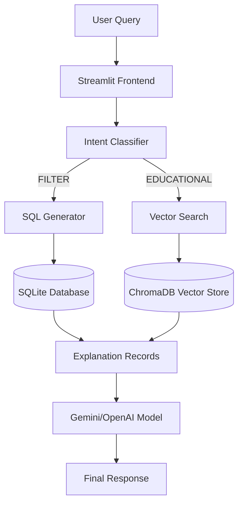

# 🏠 Real Estate Investment Ruler

<div align="center">

**A Deterministic Financial System augmented by a RAG (Retrieval-Augmented Generation) Interface**

[](https://www.python.org/)
[](https://streamlit.io/)
[](https://www.trychroma.com/)
[](https://www.sqlite.org/)
[](https://openrouter.ai/)

*Combines the safety of SQL-based financial analysis with the intelligence of Semantic Search.*

</div>

---

## 🎯 What is This Project?

This is a **Hybrid RAG Application** designed to analyze Real Estate investments (Buy vs Rent). Unlike standard chatbots, it adheres to a strict "Explanation-Second" architecture:

- **Deterministic Backend**: Financial outcomes (EMI, Tax, Wealth Difference) are pre-calculated using Python/Pandas logic.
- **RAG Layer**: The AI is strictly an *interface*. It retrieves verified data and explains it, but never performs financial math itself.

**Key capabilities:**
- 🔍 **Strict SQL Retrieval**: "Show 3 BHKs in New Town" -> Executes exact SQL.
- 🧠 **Semantic Vector Search**: "What are the tax benefits of buying?" -> Searches embedded knowledge.
- � **Hybrid Intelligence**: Combines verified numbers with natural language reasoning.

---

## ✨ Key Features

| Feature | Description |
|---------|-------------|
| 🔒 **Safety First** | Financials are hard-coded in the backend. The LLM cannot hallucinate numbers. |
| ⚡ **Hybrid retrieval** | Intelligently switches between SQL (filtering) and ChromaDB (semantic context). |
| 💰 **Buy vs Rent Analysis** | detailed comparison of EMI, Tax Regimes, and 20-Year Wealth accumulation. |
| 🎨 **Premium UI** | minimal, modern Streamlit interface with "Dark Text" readability optimizations. |
| 🚀 **Offline Capable** | Uses local `sentence-transformers` for embeddings, reducing API costs. |

---

## 🏗️ Architecture Overview



---

## 🛠️ Tech Stack

<div align="center">

| Category | Technology | Purpose |
|----------|-----------|---------|
| **� AI/ML** | Google Gemini (via OpenRouter) | Intent classification & Response generation |
| | Sentence-Transformers | Local embedding generation |
| **🌐 App Framework** | Streamlit | Full-stack UI and logic execution |
| **🗄️ Database** | SQLite | Deterministic financial data storage |
| | ChromaDB | Vector storage for semantic search |
| **🐼 Data Processing** | Pandas | Data wrangling and SQL interaction |

</div>

---

## 📦 Project Structure

```
Real_estate_analyser/
├── app.py                     # 🚀 Main Application Entry Point
├── run_app.bat                # 🖱️ One-click launcher script
├── .env                       # � API Keys (ignored by git)
├── real_estate.db             # 💾 Generated SQL Database
│
├── rag/                       # 🧠 RAG Logic Module
│   ├── __init__.py
│   ├── rag_engine.py          # Core Logic: Intent, SQL Gen, LLM interaction
│   ├── db.py                  # Database connection & schema utilities
│   └── vector_store.py        # ChromaDB setup & semantic search logic
│
├── chroma_db/                 # 📂 Vector Index (Auto-generated)
├── calculations.ipynb         # � Original Financial Analysis Notebook
└── data/                      # � Raw CSV Data Sources
```

---

## 🚀 Quick Start

### Prerequisites

- **Python 3.10+** installed
- **OpenRouter/OpenAI API Key**

### Installation

1.  **Clone the repository** (or unzip the folder).
2.  **Install Dependencies**:
    ```bash
    pip install streamlit pandas openai python-dotenv chromadb sentence-transformers
    ```
3.  **Configure Environment**:
    Create a `.env` file in the root directory:
    ```ini
    OPENAI_API_KEY=sk-or-your-key-here
    OPENAI_BASE_URL=https://openrouter.ai/api/v1
    ```

### Running the App

Refreshed the database and start the server with one click:

```bash
.\run_app.bat
```

*Or manually:*
```bash
python -m streamlit run app.py
```

---

## 💡 Example Queries

The system handles different "Intents":

### 1. Filtering (SQL Driven)
> "Show me 3 BHK properties in New Town under 80 Lakhs"
> "List all properties where buying is better than renting"

### 2. Explanation (Hybrid)
> "Why is the property in Salt Lake marked as a BUY?"
> "Explain the tax strategy used for the Villa calculation."

### 3. Educational (Vector Driven)
> "What are the benefits of Section 24b?"
> "How is rental yield calculated?"

---

## 📝 Design Principles

This project strictly follows the **Real Estate Analyzer RAG Manual**:

1.  **No Calculus in LLM**: The LLM is a narrator, not a calculator.
2.  **SQL First**: We prefer exact matches over fuzzy matches for property specs.
3.  **Property Explanation Records**: Data is converted to a text schema before embedding.

---

<div align="center">

**Built with Precision & Intelligence**

</div>
